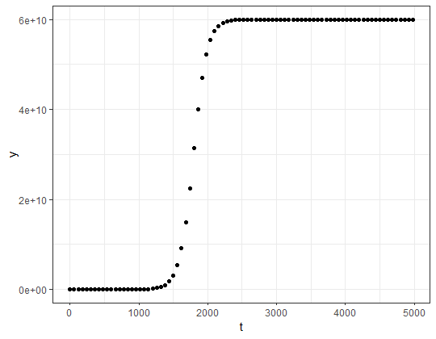
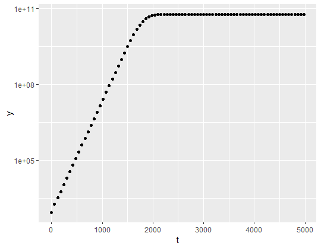
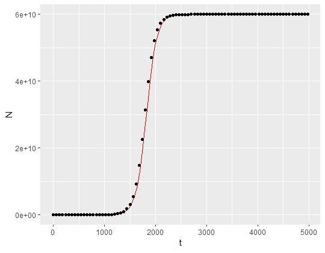
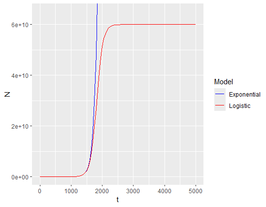

# Logistic Growth

This is an exercise done as part of a university assessment.

## How to use

1.  Use `renv::restore()` to install the correct versions of all packages used.
2.  Run each script in the `functions` folder to load each function into the environment.
3.  These functions can then be run in sequence using `full_analysis.R`. By default this uses data from `experiment.csv` but should work with any data in the same format.

## Analysis

Population growth can be described by the **logistic growth model**:

$$
\frac{dN}{dt}=Nr\left(1-\frac{N}{k}\right)
$$

Where:

-   $N$ is population size
-   $k$ is carrying capacity
-   $r$ is growth rate

This analysis aims to fit a logistic growth curve to a given set of bacterial growth data. The parameters $N_{0}$, $k$ and $r$ are estimated as follows:

-   $N_{0}$ is the earliest value of $N$ given in the dataset
-   $k$ is the intercept of a linear model fitted to the constant region of the graph. This region is selected by the user with the aid of a visual plot.
-   $r$ is the gradient of a linear model fitted to the exponential growth region of the graph. This region is also selected by the user.

## Example results

These results were acquired using `experiment.csv`. First, the population size data is plotted against time. This allows us to verify that the data roughly follows the logistic model.

Next, the same data is plotted but with the $y$ axis log-transformed. This more clearly visualises the growth phase and the carrying capacity phase. Using this plot, we can define each region. I defined the growth phase as `t < 1750`, and the carrying capacity phase as `t >= 2500`.

These linear models allow us to extract parameters for the final logistic model. $r$ is the gradient of the growth phase, and $k$ is the intercept of the carrying capacity phase. This allows us to plot a logistic growth curve with our initial data to compare the two.

We can then compare the logistic growth model with an exponential growth model. At $t = 4980$, under the exponential model $N = 2.287e+24$ but under the logistic model $N = 6e+10$. This dramatic difference illustrates the importance of factoring carrying capacity into population growth models - during the carrying capacity phase, exponential models are completely inaccurate.

